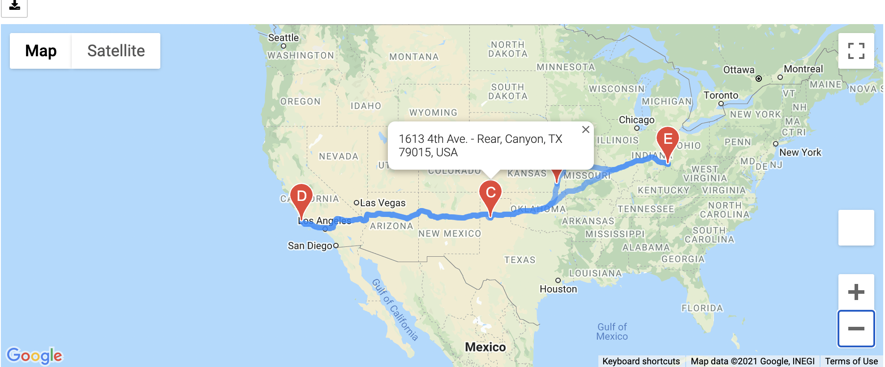
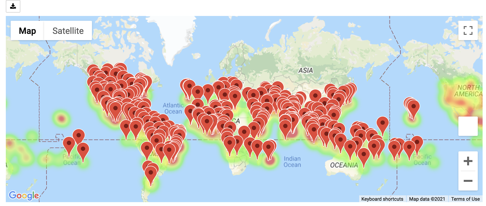

# World_Weather_Analysis

## Project Overview

In this analysis we need: 
- Retrieve Weather Data
- Create a Customer Travel Destinations Map
-  Create a Travel Itinerary Map

## Resources:

Data Source: citipy, jupyter-gmaps, OpenWeatherMap API, Google Maps and Places API, Google Maps Directions API
Software: Python 3.7.7, Anaconda Navigator 1.9.12, Conda 4.8.4, Jupyter Notebook 6.0.3

## Summary

We enerate a set of 2,000 random latitudes and longitudes, retrieve the nearest city, and perform an API call with the OpenWeatherMap. In addition to the city weather data, using API, we got he current weather description for each city. 

By using input statements we retrieved customer weather preferences, then use those preferences to identify potential travel destinations and nearby hotels. Then, show those destinations on a marker layer map with pop-up markers.

By using the Google Directions API we created a travel itinerary that shows the route between four cities chosen from the customer’s possible travel destinations. Then, we create a marker layer map with a pop-up marker for each city on the itinerary.

